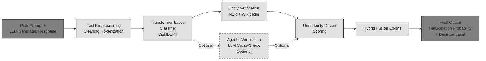

# Hybrid Hallucination Detection System for LLMs

## Clean Left-to-Right Architecture Diagram

## Component Flow (Left to Right)

1. **Input** (Rectangle, darker background)
   - User Prompt + LLM Generated Response

2. **Preprocessing** (Rounded rectangle)
   - Text Preprocessing (Cleaning, Tokenization)

3. **Transformer-based Classifier** (Primary block, larger rectangle)
   - Transformer-based Classifier (DistilBERT)
   - **Splits into two branches:**

4. **Entity Verification** (Top branch, solid line)
   - Entity Verification (NER + Wikipedia)

5. **Agentic Verification** (Bottom branch, optional, dashed)
   - Agentic Verification (LLM Cross-Check – Optional)

6. **Uncertainty-Driven Scoring** (Convergence point)
   - Uncertainty-Driven Scoring
   - Both branches converge here

7. **Hybrid Fusion Engine** (Hexagon)
   - Hybrid Fusion Engine

8. **Final Output** (Rectangle, darker background)
   - Final Output
   - Hallucination Probability
   - + Decision Label

## Styling Specifications

- **Layout**: Left-to-right flow
- **Colors**: Grayscale/neutral only
- **Font**: Sans-serif, medium size
- **Main Flow**: Solid arrows
- **Optional Path**: Dashed arrows and borders
- **Style**: Professional, research-paper quality
- **Alignment**: Balanced and evenly distributed

