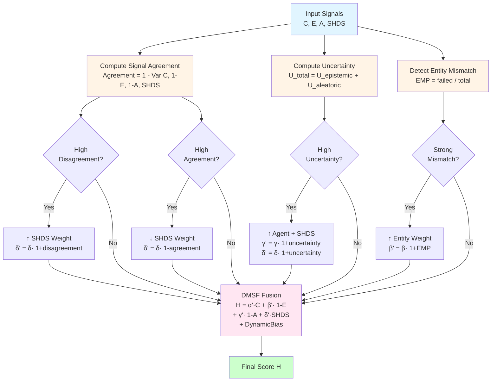

# System Architecture - Research Paper Diagrams

## Figure 1: High-Level System Architecture

```mermaid
graph TB
    Start([LLM Response R]) --> Tokenizer[Tokenization]
    
    Tokenizer --> Transformer[Transformer Classifier<br/>DistilBERT]
    Tokenizer --> EntityExt[Entity Extractor<br/>NER]
    Tokenizer --> Agentic[Agentic Verifier<br/>LLM Cross-Check]
    Tokenizer --> Uncertainty[Uncertainty Scorer<br/>MC Dropout/Ensemble]
    
    Transformer --> PTrans[P_trans H|R<br/>Classification Score]
    
    EntityExt --> EntityVer[Wikipedia Verification]
    EntityVer --> E[E<br/>Factual Score]
    
    Agentic --> A[A<br/>Verification Score]
    
    Uncertainty --> UEpistemic[U_epistemic<br/>Model Uncertainty]
    Uncertainty --> UAleatoric[U_aleatoric<br/>Data Uncertainty]
    UEpistemic --> UTotal[U_total<br/>Total Uncertainty]
    UAleatoric --> UTotal
    UTotal --> PUncertainty[P_uncertainty<br/>Uncertainty Score]
    
    PTrans --> SHDS[SHDS Calculator<br/>Novel Metric]
    E --> SHDS
    A --> SHDS
    PUncertainty --> SHDS
    SHDS --> SHDSScore[SHDS Score<br/>Multi-dimensional]
    
    PTrans --> Fusion[Fusion Engine]
    E --> Fusion
    A --> Fusion
    PUncertainty --> Fusion
    SHDSScore --> Fusion
    
    Fusion --> ClassicFusion[Classic Fusion<br/>H = α·P_trans + β·1-E + γ·1-A + δ·SHDS]
    Fusion --> DMSF[DMSF<br/>Dynamic Multi-Signal Fusion<br/>Adaptive Weights]
    
    ClassicFusion --> FinalScore[Final Score H]
    DMSF --> FinalScore
    
    FinalScore --> Classifier{Classification<br/>H ≥ threshold?}
    Classifier -->|Yes| Hallucination[Hallucination]
    Classifier -->|No| Correct[Correct]
    
    style Start fill:#e1f5ff
    style Transformer fill:#fff4e6
    style EntityExt fill:#fff4e6
    style Agentic fill:#fff4e6
    style Uncertainty fill:#fff4e6
    style SHDS fill:#ffe6f2
    style Fusion fill:#e6ffe6
    style DMSF fill:#ffe6f2
    style FinalScore fill:#e1f5ff
    style Hallucination fill:#ffcccc
    style Correct fill:#ccffcc
```

## Figure 2: Dynamic Multi-Signal Fusion (DMSF) Process



## Mathematical Formulations

### Classic Fusion
$$H = \alpha \cdot P_{trans} + \beta \cdot (1-E) + \gamma \cdot (1-A) + \delta \cdot SHDS$$

where $\alpha + \beta + \gamma + \delta = 1$.

### DMSF Dynamic Weight Adjustment
$$\text{Agreement} = 1 - \text{Var}[\{P_{trans}, 1-E, 1-A, SHDS\}]$$

$$H_{DMSF} = \alpha' \cdot P_{trans} + \beta' \cdot (1-E) + \gamma' \cdot (1-A) + \delta' \cdot SHDS + \text{DynamicBias}$$

where weights are dynamically adjusted based on signal agreement, uncertainty, and entity mismatch.

### SHDS Calculation
$$SHDS = w_1 \cdot ED + w_2 \cdot EMP + w_3 \cdot RI + w_4 \cdot TU$$

where:
- $ED$ = Embedding Divergence
- $EMP$ = Entity Mismatch Penalty
- $RI$ = Reasoning Inconsistency
- $TU$ = Token Uncertainty
